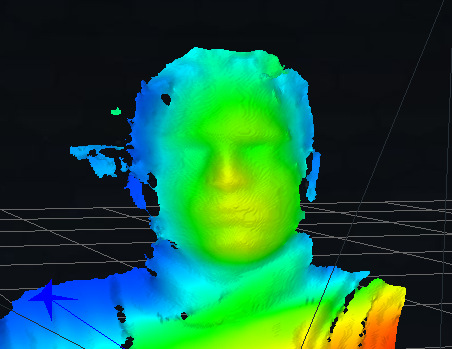

<p align="center">

</p>

# Context

From expensive [LiDAR](https://en.wikipedia.org/wiki/Lidar) to entry-level [Time-Of-Flight (TOF)](https://en.wikipedia.org/wiki/Time-of-flight_camera) cameras, point clouds and associated ROS2 [sensor_msgs/PointCloud2](https://docs.ros.org/en/ros2_packages/rolling/api/sensor_msgs/interfaces/msg/PointCloud2.html) message are nowadays a need for environnement sensing. Due to sensor diversity, understanding and configuring the highly customable [sensor_msgs/PointCloud2](https://docs.ros.org/en/ros2_packages/rolling/api/sensor_msgs/interfaces/msg/PointCloud2.html) could be headache and time consuming.

# Description

**Pc2Gen aims to lower time and code complexity of [sensor_msgs/PointCloud2](https://docs.ros.org/en/ros2_packages/rolling/api/sensor_msgs/interfaces/msg/PointCloud2.html) integration** within [ROS2](https://docs.ros.org/en/rolling/index.html) or [micro-ros](https://micro.ros.org) project by generating, from descriptions, the handling C code.

> [!NOTE]
> * Pc2Gen has been built upon [Pc2Gen_lib](https://github.com/fofolevrai/pc2Gen_lib) library

# Get Started

Four steps are needed to generate your C custom PointCloud2 message :
1. If not already informed, add your [pointFields](https://docs.ros.org/en/ros2_packages/rolling/api/sensor_msgs/interfaces/msg/PointField.html) elements to the [pointField_def.yaml](asset/pointField_def.yaml) file.
2.  Describe your message in the [device_def.yaml](asset/device_def.yaml) file
3.  Run pc2Gen python script
4.  Add generated files to your project and call instanciation function

# Dependencies

pc2Gen relies on following packages :

* [Python 3.7](https://www.python.org/downloads) or above version
* The python yaml extention
```bash
pip install pyyaml
```
To compile and run generated example, you also need installed on your machine :
* [ROS2](https://docs.ros.org/en/rolling/Releases.html) and relatives compiling tools
* Optionnaly, [micro-ros](https://micro.ros.org/docs/tutorials/core/first_application_linux) if you which to target embedded platforms

# Usage

Let's create a basic X-Y-Z [sensor_msgs/PointCloud2](https://docs.ros.org/en/ros2_packages/rolling/api/sensor_msgs/interfaces/msg/PointCloud2.html) message :

Clone this repository to your workspace :
```bash
git clone https://github.com/fofolevrai/pc2Gen.git && cd pc2Gen
```
**1.  Describe the PointCloud2 message**

In this root directory, create a file `xyz_device.yaml` which discribes the ordered data that will be populated by your sensor.

```yaml
devices:
 - name: "xyz_device"
   pointFields:
    - name: "x"
    - name: "y"
    - name: "z"
```
> [!TIP]
> In the example, each sensor pixel will represent the cartesian coordinates X, Y, and Z.

**2. Generate relative C code**

Open a terminal pointing to the root directory and run Pc2Gen :

```bash
python3 pc2Gen.py
```
C files `point_cloud2_iterator.h` and `point_cloud2_iterator.c` should be generated within the root directory :
```bash
Files generated with success :
        * point_cloud2_iterator.h
        * point_cloud2_iterator.c
```
This files contain the PointCloud2 message and helper functions.

> [!NOTE]  
> For more complex usage, please refer to the [dedicated page](doc/DEFINITION.md).

## Integrate pc2Gen generated code to your project

Generated files contain helper functions to instanciate and manipulate your PointCloud2 message.

**1. Instanciation**

To instanciate your PointCloud2 message, call the function `CreatePointCloud2FromDevice` as follow :

```C
  /* PointCloud2 declaration */
  sensor_msgs__msg__PointCloud2 cloud;

  /* Mock (sensor characteristics) */
  uint32_t height_size = 8;     // Nbr line pixels
  uint32_t width_size = 8;      // Nbr column pixels
  bool is_bigendian = false;    // Data bytes ordering
  
  /* PointCloud2 instanciation */
  bool success = CreatePointCloud2FromDevice(&cloud, "xyz_device", height_size, width_size, is_bigendian);
```
On success return, function `CreatePointCloud2FromDevice` allocates needed memory space and populates fields regarding the given information from both `pointField_def.yaml` and `device_def.yaml` files.

**2. Data feeding**

Feed the message with your sensor data :

```C
//  cloud.data.data is type pointer as described
//  in the 'pointField_def.yaml' file
(float) * my_xyz_sensor_data;

/*
*   Fetch X-Y-Z data from your sensor ...
*/

//  Link data cloud pointer to your fetched data
cloud.data.data = my_xyz_sensor_data;
```
> [!WARNING]  
> * Do respect the data ordering as described in the [device_def.yaml](asset/device_def.yaml) file.
> * Do respect the data type as informed in the [pointField_def.yaml](asset/pointField_def.yaml) file

## Compile your code

This step consists of ROS/ROS2 [package](https://docs.ros.org/en/rolling/Tutorials/Beginner-Client-Libraries/Creating-Your-First-ROS2-Package.html) creation.

## Examples

TBD

**Intel realsense D4xx**

<p align="left">

</p>

**ST VL53Lx**

*TBD*

# Test

Please refer to [Pc2Gen_lib test section](https://github.com/fofolevrai/pc2Gen_lib#test-library).

# Issue

If you find issue(s), please report to the [dedicated tumb](https://github.com/fofolevrai/pc2Gen/issues)
# Contribute

Contributions are what make the open source community such an amazing place to learn, inspire, and create. Any contributions you make are **greatly appreciated**.

If you have a suggestion that would make this better, please fork the repo and create a pull request. You can also simply open an issue with the tag "enhancement".
Don't forget to give the project a star! Thanks again!

1. Fork the Project
2. Create your Feature Branch (`git checkout -b feature/AmazingFeature`)
3. Commit your Changes (`git commit -m 'Add some AmazingFeature'`)
4. Push to the Branch (`git push origin feature/AmazingFeature`)
5. Open a Pull Request

## Contributors

* [@fofolevrai](https://github.com/fofolevrai)


## License

This project is provided under the [BSD-3](https://opensource.org/license/bsd-3-clause) License - see the [LICENCE.md](LICENCE.md) file for details


